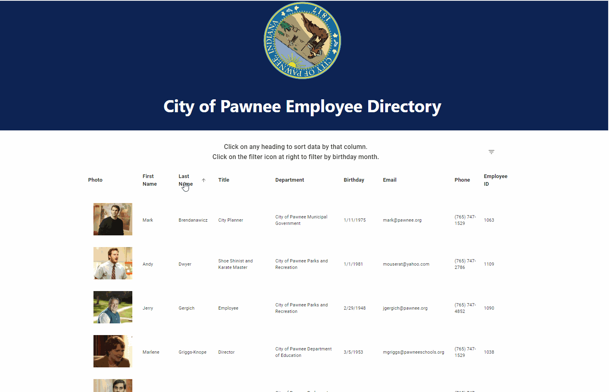

### Employee Directory

This app was built for a Berkeley Coding Boot Camp assignment which required use of React and stateful components to build a table which allows users to filter and sort on at least one field.  My Employee Directory presents an interactive table of employee photos and information featuring the cast of the hit comedy Parks and Recreation as seed data.  Users can sort on any column by clicking the column heading, filter by birthday month, and click a button to refresh the data.  

This version is actually a rebuild of my [original project](#original).  In the first version, I used React Bootstrap for the style framework.  As I gained more experience in React, I discovered Material UI and came to prefer that.  I knew the decision to rebuild a Bootstrap app with Material UI encompassed extra work, but it was actually a great learning experience.

## Contents | Quick Links
[Getting Started](#start)     |     [Demo](#demo)     |     [Built With](#built)     |     [Authors](#author)     |     [Visuals](#visuals)     |     [Contributing & Tests](Contributing.md)     |     [Contact](#contact)

## [Getting Started](#start)

### Download the app from the Git Hub repo here:
* [github.com/jenjayme/new-employee-directory](https://github.com/jenjayme/new-employee-directory)

In the project directory, run:
* ### `npm start`

### <a id="demo">View a demo here:</a> 
* [jenjayme.github.io/new-employee-dir](https://jenjayme.github.io/new-employee-dir/#demo)

## [Visuals](#visuals)

## <a id="built">Built With</a>
* HTML5 & CSS
* [Javascript](https://www.javascript.com/)
* [React.js](https://reactjs.org/)
* [Create React App](https://github.com/facebook/create-react-app)
* [Material UI](https://material-ui.com/)
* [VS Code](https://code.visualstudio.com/)
* [Node.js](https://nodejs.org/)
* [NPM](https://www.npmjs.com/)
* [Express.js](https://expressjs.com/)

## <a id="original">Original Version</a>
My first version of the assignment, built with React Bootstrap, looked nice but didn't have the sort and filter functionality required, and I was still wrestling to learn how to build stateful components.  You can see the first version of my Employee Directory at the links below. 
* [Version 1 Repo](https://github.com/JenJayme/employee-directory)
* [Version 1 Deployed](https://jenjayme.github.io/employee-directory/)

## <a id="contact">Questions</a>
For questions or to discuss collaborations on this or other projects, contact the author via LinkedIn or GitHub as follows.

## <a id="author">Author</a>

**Jen Jayme** 
[linkedin.com/jenjayme](https://www.linkedin.com/in/jenjayme) 
[github.com/jenjayme](https://github.com/JenJayme)

## Acknowledgements
* Special thanks to Jerome Chenette, UC Berkeley Coding Boot Camp and Trilogy Education Services for referring this project.
* Shout out to Fred Rodolfo for critical tutoring advice and support.
* Much love to Leslie Knope and her team from Parks and Rec for many hours of entertainment.  